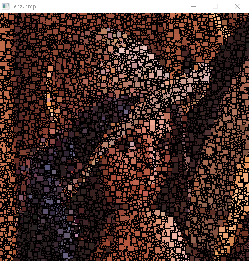
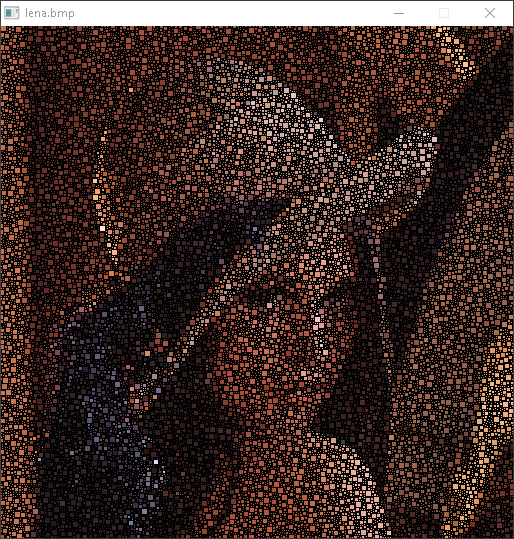
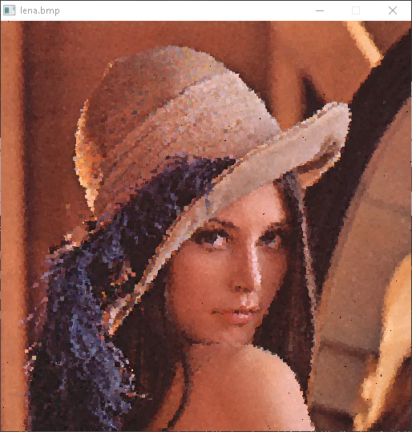

# mosaic image effect

This useless program was developped during my SDL2 learnings

I publish it in the hope the code would be benificial to anybody trying to :

* load an image into an SDL Surface
* read a pixel value from an SDL_Surface
* test box collisions
* manage events during calculations

or use it as a starting point to do their own image manipulations

### Usage :
`mosaic <bmp filename> <numbers of blocks> <max block size> [collide]`

The last argument is optionnal and can be any string - if set the blocks won't overlap

### Examples :

`mosaic lena.bmp 15000 12 1`

`mosaic lena.bmp 25000 6 1`

`mosaic.exe lena.bmp 200000 6`

